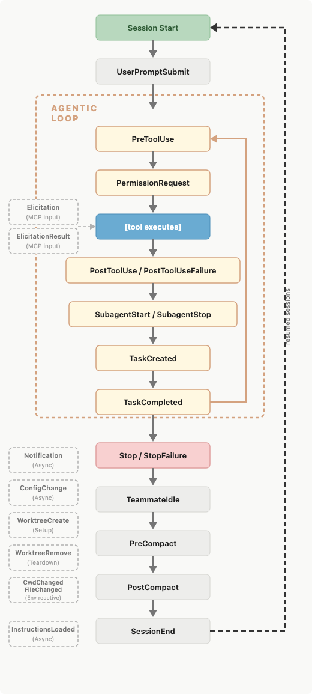

# Week 3 (Supplemental): Claude Code — Local Dev Power Tools

**Track:** AI Engineering | **Duration:** 6–8 hours
**Prerequisites:** Week 1 (API basics), Week 2 (chatbot memory), a working Claude Code install (`claude --version`)

---

## Why This Week Exists

The rest of this curriculum teaches you to *build* AI systems. This week teaches you to *work inside* one. Claude Code is not just a code editor assistant — it is a programmable, extensible agent harness. The engineers who master its internals write code two to five times faster than those who treat it as a fancy autocomplete.

The five pillars covered here — **memory**, **contexts**, **hooks**, **skills**, and **subagents** — compound. A well-configured hook enforces your code style so you stop repeating the same review comment. A skill packages your deploy workflow so you type `/deploy` instead of three paragraphs of instructions. A subagent keeps expensive exploration out of your main context window. Context files break large CLAUDE.md files into composable, importable pieces. Auto-memory makes Claude progressively smarter about your project without any manual effort.

The [everything-claude-code](https://github.com/affaan-m/everything-claude-code) repository (an Anthropic hackathon winner) demonstrates this at scale: 28 specialized agents, 125+ skills, 60+ hooks, all built on the same primitives you will practice this week.

**This repo is already configured.** By the time you read this, `.claude/` contains working rules, hooks, skills, agents, and MCP configs that you will read, analyze, and extend. The lab exercises work with real files — not toy examples.

---

## Learning Objectives

By the end of this week you will:

- Read and extend `CLAUDE.md` files using `@`-imported context files
- Write path-scoped rules in `.claude/rules/` that load only for matching files
- Understand how auto-memory reads and writes `MEMORY.md`
- Read and test lifecycle hooks (`PreToolUse`, `PostToolUse`, `Stop`, `SessionStart`)
- Distinguish commands (`.claude/commands/`) from skills (`.claude/skills/`) and know when to use each
- Write commands that enforce structured workflows with dynamic context injection
- Create skills with YAML frontmatter, argument substitution, and `context: fork`
- Define custom subagents with restricted tools, custom models, and persistent memory
- Configure MCP servers in `.mcp.json` for external tool access
- Compose all six pillars into a coherent local developer workflow

---

## What's Already in `.claude/`

This repo ships with a complete configuration. Study these files — the lab exercises build on them:

```
.claude/
├── settings.json              # Wired hooks (all events, all matchers)
├── contexts/                  # @-imported into CLAUDE.md — edit here, not in CLAUDE.md
│   ├── architecture.md        # Repo layout, curriculum map, key decisions
│   ├── models.md              # OpenAI / Anthropic / Ollama model reference
│   └── lab-conventions.md     # Exact format spec for lab notebooks
├── rules/                     # Path-scoped rules, loaded only for matching files
│   ├── python.md              # **/*.py — uv, f-strings, pathlib, OpenAI patterns
│   ├── testing.md             # tests/**/*.py — pytest, mocking, parametrize
│   ├── security.md            # (always) — secrets, injection, dependency audit
│   ├── notebooks.md           # labs/**/*.ipynb — cell order, <details> integrity
│   └── api-design.md          # projects/**/*.py — REST, Pydantic, error format
├── hooks/                     # All executable shell scripts
│   ├── detect-secrets.sh      # PreToolUse → blocks hardcoded secrets in edits
│   ├── format-python.sh       # PostToolUse async → ruff format + ruff check --fix
│   ├── validate-notebook.sh   # PostToolUse async → nbformat check, TODO count
│   ├── audit-log.sh           # PostToolUse async → appends to ~/.claude/audit.jsonl
│   ├── run-tests.sh           # Stop async → pytest if .py files were modified
│   └── load-env.sh            # SessionStart → exports .env into Claude's shell
├── commands/                  # Structured workflow macros: /name (flat .md files)
│   ├── plan.md                # /plan — pause, design, wait for confirmation before coding
│   ├── tdd.md                 # /tdd — red→green→refactor cycle with coverage enforcement
│   ├── eval.md                # /eval — define/check/report evals for AI system features
│   ├── orchestrate.md         # /orchestrate — coordinate multiple agents sequentially
│   └── skill-create.md        # /skill-create — extract patterns from git history → SKILL.md
├── skills/                    # Rich slash commands: /name (SKILL.md with frontmatter)
│   ├── commit/SKILL.md        # /commit — conventional commit with Co-Authored-By
│   ├── review/SKILL.md        # /review [file] — Critical/Warning/Suggestion report
│   ├── new-week/SKILL.md      # /new-week N topic — scaffold agenda + lab notebook
│   ├── explain/SKILL.md       # /explain [file] — analogy + ASCII diagram + gotcha
│   ├── debug/SKILL.md         # /debug [error] — systematic root cause analysis
│   └── lab-status/SKILL.md    # /lab-status — progress across all lab notebooks
└── agents/                    # Custom subagents
    ├── doc-researcher.md      # Haiku + project memory — finds topics in curriculum
    ├── code-reviewer.md       # Sonnet + project memory — AI/ML aware review
    ├── python-linter.md       # Haiku, no Edit/Write — ruff + mypy report only
    └── notebook-validator.md  # Haiku, read-only — checks notebook conventions
```

Also at the root: `.mcp.json` — five MCP servers (filesystem, github, memory, brave-search, fetch).

---

## Part 1 — Memory: How Claude Remembers Your Project

### 1.1 The Two Memory Systems

Every Claude Code session starts with a fresh context window. Two mechanisms carry knowledge across sessions:

| System              | Who writes it   | What it contains       | Scope                | Loaded into                                  |
|---------------------|-----------------|------------------------|----------------------|----------------------------------------------|
| **CLAUDE.md files** | You             | Instructions and rules | Project / user / org | Every session (full)                         |
| **Auto memory**     | Claude          | Learnings and patterns | Per working-tree     | Every session (first 200 lines of MEMORY.md) |

These are complementary, not competing. Write `CLAUDE.md` for stable project rules. Let auto-memory capture the ephemeral things Claude discovers — which test command is flaky, which module is deprecated, which pattern you corrected twice.

### 1.2 CLAUDE.md File Hierarchy

Claude walks up the directory tree from your current working directory and loads every `CLAUDE.md` it finds. More specific paths override broader ones.

```
/Library/Application Support/ClaudeCode/CLAUDE.md   # Org-wide (managed IT)
~/.claude/CLAUDE.md                                  # All your projects
~/.claude/rules/*.md                                 # Personal rules by topic
<repo>/CLAUDE.md  or  <repo>/.claude/CLAUDE.md      # This project (shared)
<repo>/.claude/settings.local.json                  # Project-local exclusions
```

**Resolution order (highest wins):** managed policy → user → project → subdirectory

Subdirectory `CLAUDE.md` files are loaded *lazily* — only when Claude reads files in that subdirectory. This is useful in monorepos: the `backend/` folder can carry database schema guidance that never pollutes a frontend session.

### 1.3 Context Files — Splitting CLAUDE.md with `@`-imports

CLAUDE.md files should stay under 200 lines. For larger projects, split detailed context into separate files and import them with `@path/to/file`:

```markdown
# CLAUDE.md

<!-- Extended context — edit context files, not this file -->
@.claude/contexts/architecture.md
@.claude/contexts/models.md
@.claude/contexts/lab-conventions.md
```

**How this repo uses it:** `CLAUDE.md` imports three context files from `.claude/contexts/`:

| File                 | Content                                                              | Why separate                                    |
|----------------------|----------------------------------------------------------------------|-------------------------------------------------|
| `architecture.md`    | Repo layout, curriculum map, key technical decisions                 | Changes rarely; keeps CLAUDE.md clean           |
| `models.md`          | OpenAI/Anthropic/Ollama model table, `scripts/model_config.py` usage | Useful across all weeks, easy to update         |
| `lab-conventions.md` | Exact notebook format spec, exercise cell template                   | Reference for when Claude creates/modifies labs |

Context files are expanded into Claude's context at session start — they behave exactly as if their content were inside CLAUDE.md itself. Block HTML comments (`<!-- ... -->`) are stripped before injection, so you can leave maintainer notes at zero token cost.

**When to put something in a context file vs. a rule file:**
- **Context file** (`contexts/`) — general reference material, always relevant, not file-type specific
- **Rule file** (`rules/`) — instructions that only apply when working on specific file types (use `paths:` frontmatter)

### 1.4 Scoped Rules with `.claude/rules/`

Rules without `paths` frontmatter load every session. Rules with `paths` load only when Claude opens a matching file — critical for keeping Python rules out of notebook sessions and vice versa.

**This repo's rules:**

| File            | Paths              | Loads when...                    |
|-----------------|--------------------|----------------------------------|
| `security.md`   | (none)             | Always                           |
| `python.md`     | `**/*.py`          | Claude opens any Python file     |
| `testing.md`    | `tests/**/*.py`    | Claude opens a test file         |
| `notebooks.md`  | `labs/**/*.ipynb`  | Claude opens a lab notebook      |
| `api-design.md` | `projects/**/*.py` | Claude opens project source code |

A path-scoped rule example (from `api-design.md`):

```markdown
---
paths:
  - "projects/**/*.py"
  - "src/**/*.py"
---

# API Design Rules

- All endpoints validate input with a Pydantic model
- Error format: {"error": str, "code": "MACHINE_READABLE_CODE"}
- Return 201 for created, 204 for deleted — never 200 with {"success": false}
```

**Glob pattern syntax for `paths`:**

| Pattern             | Matches                                  |
|---------------------|------------------------------------------|
| `**/*.py`           | All Python files in any directory        |
| `tests/**/*.py`     | Python files only under `tests/`         |
| `labs/**/*.ipynb`   | Notebooks only under `labs/`             |
| `src/**/*.{ts,tsx}` | TypeScript and TSX anywhere under `src/` |

### 1.5 Auto Memory Deep Dive

Auto memory lives at:

```
~/.claude/projects/<git-root-hash>/memory/
├── MEMORY.md          # Index — first 200 lines loaded every session
├── debugging.md       # Detailed notes Claude moves here to keep index lean
├── patterns.md        # Architectural decisions, recurring patterns
└── ...
```

The `MEMORY.md` file is the only one loaded automatically. When it grows beyond 200 lines, Claude is instructed to move detailed notes into topic files and keep `MEMORY.md` as a concise index.

**What Claude saves:** build commands it discovered, test patterns that work, errors you corrected, personal preferences you stated. It does *not* save every session — only when information would genuinely help future conversations.

**Explicit saves:**
```
Remember that the integration tests require a local Redis instance on port 6380.
```

**Browse and edit:** run `/memory` in any session to see all loaded files, toggle auto-memory, and open the memory folder for direct editing.

**Subagent memory** is separate. Custom subagents with `memory: user|project|local` build their own expertise. The `code-reviewer` and `doc-researcher` agents in this repo both use `memory: project` — they accumulate knowledge in `.claude/agent-memory/<name>/`.

---

## Part 2 — Hooks: Automating Claude's Lifecycle

### 2.1 What Hooks Are

Hooks are shell commands, HTTP endpoints, LLM prompts, or agents that fire automatically at specific points in Claude's lifecycle. They can:

- **Block** dangerous operations before they run (exit 2)
- **Validate and modify** tool inputs (`updatedInput` in JSON output)
- **Inject context** into Claude's thinking (`additionalContext`)
- **Log and audit** every action Claude takes (async, no blocking)
- **Enforce policies** — code style, security, commit conventions

Hooks are the programmable layer between Claude's decisions and your system. They give you deterministic control over a probabilistic agent.



### 2.2 Hook Configuration

Hooks live in `.claude/settings.json`. This repo's settings wire all six scripts:

```json
{
  "hooks": {
    "SessionStart": [
      {
        "matcher": "startup|resume",
        "hooks": [{ "type": "command", "command": "\"$CLAUDE_PROJECT_DIR\"/.claude/hooks/load-env.sh" }]
      }
    ],
    "PreToolUse": [
      {
        "matcher": "Edit|Write|MultiEdit",
        "hooks": [{ "type": "command", "command": "\"$CLAUDE_PROJECT_DIR\"/.claude/hooks/detect-secrets.sh" }]
      }
    ],
    "PostToolUse": [
      {
        "matcher": "Edit|Write|MultiEdit",
        "hooks": [
          { "type": "command", "command": "\"$CLAUDE_PROJECT_DIR\"/.claude/hooks/format-python.sh", "async": true },
          { "type": "command", "command": "\"$CLAUDE_PROJECT_DIR\"/.claude/hooks/validate-notebook.sh", "async": true },
          { "type": "command", "command": "\"$CLAUDE_PROJECT_DIR\"/.claude/hooks/audit-log.sh", "async": true }
        ]
      },
      {
        "hooks": [{ "type": "command", "command": "\"$CLAUDE_PROJECT_DIR\"/.claude/hooks/audit-log.sh", "async": true }]
      }
    ],
    "Stop": [
      {
        "hooks": [{ "type": "command", "command": "\"$CLAUDE_PROJECT_DIR\"/.claude/hooks/run-tests.sh", "async": true }]
      }
    ]
  }
}
```

Note: `$CLAUDE_PROJECT_DIR` is set by Claude Code to the project root. Wrapping it in quotes handles paths with spaces.

### 2.3 Hook Lifecycle Events

| Event                    | When it fires              | Blockable?   | Common use                      |
|--------------------------|----------------------------|--------------|---------------------------------|
| `SessionStart`           | Session begins/resumes     | No           | Load env vars, greet user       |
| `UserPromptSubmit`       | User submits prompt        | Yes          | Content policy, injection guard |
| `PreToolUse`             | Before any tool runs       | Yes          | Block dangerous commands        |
| `PermissionRequest`      | Permission dialog shown    | Yes          | Auto-approve safe operations    |
| `PostToolUse`            | After tool succeeds        | No           | Lint after edits, log actions   |
| `PostToolUseFailure`     | After tool fails           | No           | Alert, diagnostics              |
| `Stop`                   | Claude finishes responding | Yes          | Run tests, notify               |
| `SubagentStart/Stop`     | Subagent lifecycle         | Stop only    | Setup/teardown resources        |
| `FileChanged`            | Watched file changes       | No           | Hot-reload, format on save      |
| `CwdChanged`             | Directory changes          | No           | Context switching               |
| `PreCompact/PostCompact` | Context compaction         | No           | Pre-save state                  |

### 2.4 Exit Codes and JSON Output

| Exit code   | Meaning                                                                  |
|-------------|--------------------------------------------------------------------------|
| `0`         | Success — parse JSON from stdout                                         |
| `2`         | **Blocking error** — stderr message fed back to Claude, tool call denied |
| Any other   | Non-blocking error — shown in verbose mode only                          |

Full JSON response schema (stdout from exit 0):

```json
{
  "hookSpecificOutput": {
    "hookEventName": "PreToolUse",
    "permissionDecision": "deny",
    "permissionDecisionReason": "Hardcoded secret detected",
    "updatedInput": { "command": "modified command" },
    "additionalContext": "Context injected into Claude's next turn"
  }
}
```

### 2.5 The Six Hooks in This Repo

**`load-env.sh`** — `SessionStart`

Reads `.env` from the repo root and writes `export KEY=VALUE` lines into `$CLAUDE_ENV_FILE` so they persist in Claude's shell context for the session. Also sets `AI_TRACK_ROOT` and `PYTHONPATH`.

**`detect-secrets.sh`** — `PreToolUse` on `Edit|Write|MultiEdit` (blocking)

Extracts `new_string` or `content` from the tool input. Checks against a regex for `password =`, `api_key =`, `token =`, etc. with literal string values. Exits 2 if a secret is found. Whitelists env var access patterns (`os.environ`, `os.getenv`, `${VAR}`).

**`format-python.sh`** — `PostToolUse` on `Edit|Write|MultiEdit` (async)

Extracts `path` from tool input. If it ends in `.py`, finds the git root and runs `uv run ruff format` + `uv run ruff check --fix` quietly. Never blocks — errors go to `/dev/null`.

**`validate-notebook.sh`** — `PostToolUse` on `Edit|Write|MultiEdit` (async)

If the edited file ends in `.ipynb`, uses `jq` to validate the nbformat structure and count remaining `# TODO` cells. Reports to stderr (informational only).

**`audit-log.sh`** — `PostToolUse` all tools (async)

Appends a compact JSON entry to `~/.claude/audit.jsonl` with timestamp, session ID, event name, tool name, and shortened path. Useful for reviewing what Claude did in a session.

**`run-tests.sh`** — `Stop` (async)

Checks the transcript for any modified `.py` files. If found, runs `uv run pytest tests/ -q --tb=short` and shows the last 15 lines of output. Only fires when Python files were actually changed.

### 2.6 Hook Types

**Command** (most common) — shell script, JSON on stdin:
```json
{ "type": "command", "command": ".claude/hooks/my-script.sh", "async": false }
```

**HTTP** — POST to an external endpoint:
```json
{ "type": "http", "url": "http://localhost:8080/hooks/validate", "timeout": 30,
  "headers": { "Authorization": "Bearer $MY_TOKEN" }, "allowedEnvVars": ["MY_TOKEN"] }
```

**Prompt** — single-turn Claude evaluation:
```json
{ "type": "prompt", "prompt": "Does this command look safe? Answer YES or NO." }
```

**Agent** — spawns a subagent for complex validation:
```json
{ "type": "agent", "agent": "security-scanner" }
```

---

## Part 3 — Skills: Reusable Workflows

### 3.1 What Skills Are

Skills are `SKILL.md` files in `.claude/skills/<name>/`. When you type `/skill-name` or ask something matching the skill's description, Claude loads the instructions and follows them.

Skills are the right tool for workflows you repeat. Not for knowledge you want always loaded (use CLAUDE.md/contexts), and not for one-off tasks (just ask directly).

### 3.2 The Six Skills in This Repo

| Skill               | Invocation    | What it does                                                         |
|---------------------|---------------|----------------------------------------------------------------------|
| `/commit [message]` | Manual only   | Conventional commit with type prefix and Co-Authored-By              |
| `/review [file]`    | Manual only   | Critical/Warning/Suggestion report, git diff aware                   |
| `/new-week N topic` | Manual only   | Scaffolds `agenda/week_N_topic.md` + `labs/week_N_topic.ipynb`       |
| `/explain [file]`   | Auto + manual | Analogy → ASCII diagram → step-by-step → gotcha                      |
| `/debug [error]`    | Auto + manual | Reproduce → hypothesize → investigate → fix → verify                 |
| `/lab-status`       | Manual only   | Progress table + "next recommended exercise" (runs in fork subagent) |

`disable-model-invocation: true` on `commit`, `review`, `new-week`, `lab-status` — Claude will never trigger these automatically.

### 3.3 Skill File Structure

```
.claude/skills/
└── review/
    └── SKILL.md          # Frontmatter + instructions
```

**`review/SKILL.md` example (abridged):**

```yaml
---
name: review
description: Run a structured code review on recent changes or a specific file.
argument-hint: "[file-or-directory]"
disable-model-invocation: true
allowed-tools: Read, Bash(git *), Grep, Glob
---

**Target:** Use `$ARGUMENTS` if provided, otherwise: `git diff HEAD`

## Review checklist for each changed file
1. **Correctness** — Logic errors, edge cases, null handling
2. **Security** — Hardcoded secrets, injection risks, missing validation
3. **Performance** — Batching, caching, N+1 patterns
4. **Test coverage** — Are changed paths tested?

## Output format
### Critical (block merge)
`file.py:42` — [Security] ...

### Warnings / Suggestions / Summary
```

### 3.4 Frontmatter Reference

| Field                      | Default         | Purpose                                               |
|----------------------------|-----------------|-------------------------------------------------------|
| `name`                     | directory name  | Slash command name                                    |
| `description`              | first paragraph | Claude uses this to decide when to auto-load          |
| `argument-hint`            | —               | Shown during tab-complete                             |
| `disable-model-invocation` | `false`         | `true` = only you can invoke                          |
| `user-invocable`           | `true`          | `false` = Claude invokes, hidden from `/` menu        |
| `allowed-tools`            | inherit         | Restrict Claude's tools during this skill             |
| `model`                    | inherit         | Override model for this skill                         |
| `context`                  | inline          | `fork` = run in isolated subagent                     |
| `agent`                    | general-purpose | Which subagent when `context: fork`                   |
| `paths`                    | —               | Glob patterns — auto-activate only for matching files |

### 3.5 Invocation Control

| Frontmatter                      |  You can type `/name`   | Claude auto-triggers | In context                |
|----------------------------------|-------------------------|---------------------|---------------------------|
| (default)                        | Yes                     | Yes | Description always loaded |
| `disable-model-invocation: true` | Yes                     | **No** | Description not loaded    |
| `user-invocable: false`          | **No**                  | Yes | Description always loaded |

Use `disable-model-invocation: true` for anything with side effects. You do not want Claude deciding to commit or deploy because the code "looks ready."

### 3.6 Argument Substitution

| Variable               | Expands to                      |
|------------------------|---------------------------------|
| `$ARGUMENTS`           | Everything after the skill name |
| `$ARGUMENTS[0]`, `$0`  | First argument                  |
| `$ARGUMENTS[1]`, `$1`  | Second argument                 |
| `${CLAUDE_SESSION_ID}` | Current session ID              |
| `${CLAUDE_SKILL_DIR}`  | Directory containing SKILL.md   |

The `/new-week` skill uses `$ARGUMENTS[0]` for week number and `$ARGUMENTS[1]` for topic name.

### 3.7 Dynamic Context Injection with `` !`command` ``

Shell commands inside `` !`...` `` run *before* the skill reaches Claude. The output is inlined:

```yaml
---
name: lab-status
context: fork
agent: Explore
---

**Notebooks:**
```
!`ls -1 labs/*.ipynb 2>/dev/null | sort`
```

**Open TODOs:**
```
!`grep -rn "# TODO" labs/ --include="*.ipynb" | head -20`
```
```

Claude receives the actual ls output — not the command itself.

### 3.8 Skills That Fork

`/lab-status` and `/debug` run with `context: fork` — they spawn an isolated subagent, explore independently, and return only the summary to your main conversation. Exploration tokens never pollute your main context.

---

## Part 3.5 — Commands: Structured Workflow Macros

### 3.5.1 Commands vs Skills

Both commands and skills create `/name` slash commands. They differ in format, power, and when to use each:

| Dimension             | Commands (`.claude/commands/*.md`)                | Skills (`.claude/skills/<name>/SKILL.md`)                |
|-----------------------|---------------------------------------------------|----------------------------------------------------------|
| **Format**            | Single flat `.md` file                            | Directory with YAML frontmatter                          |
| **Complexity**        | Simple prompt templates                           | Rich: tool restrictions, model override, `context: fork` |
| **Dynamic injection** | `` !`shell command` `` runs before Claude sees it | Same                                                     |
| **Tool control**      | None — inherits all                               | `allowed-tools:`, `model:`, `agent:`                     |
| **Auto-trigger**      | Not supported                                     | Controlled via `disable-model-invocation`                |
| **Best for**          | Structured workflows with fixed stages            | Reusable tools with strict isolation or model routing    |

**Rule of thumb:** Start with a command. Promote it to a skill when you need tool restrictions, a specific model, or context isolation (`context: fork`).

### 3.5.2 The Five Commands in This Repo

| Command                                          | File              | What it enforces                                                             |
|--------------------------------------------------|-------------------|------------------------------------------------------------------------------|
| `/plan [$task]`                                  | `plan.md`         | Think before coding — produces phased plan, halts until user confirms        |
| `/tdd [$feature]`                                | `tdd.md`          | Red → green → refactor cycle with coverage targets                           |
| `/eval [define\|check\|report\|list] [$feature]` | `eval.md`         | Eval-driven AI development — define pass criteria, measure against baselines |
| `/orchestrate [$task]`                           | `orchestrate.md`  | Sequential multi-agent workflows (feature / bugfix / refactor / review)      |
| `/skill-create [$depth]`                         | `skill-create.md` | Mine git history for repeating patterns and generate SKILL.md files          |

### 3.5.3 Command File Anatomy

A command file is a plain markdown prompt. Two features make it dynamic:

**Dynamic context injection with `` !`...` ``**

Shell commands inside backtick-bang blocks run *before* Claude sees the file. The stdout is substituted inline:

```markdown
## Current git state
!`git log --oneline -10`

## Test status
!`uv run pytest --collect-only -q 2>/dev/null | tail -5`
```

Claude receives the actual output — the command itself is invisible to it. Use this to inject live context: current branch, failing tests, open TODOs, recent commits.

**Argument substitution**

| Variable        | Expands to                                      |
|-----------------|-------------------------------------------------|
| `$ARGUMENTS`    | Everything the user typed after `/command-name` |
| `$ARGUMENTS[0]` | First argument                                  |
| `$ARGUMENTS[1]` | Second argument                                 |

```markdown
# /plan — Implementation Planning

Task: **$ARGUMENTS**
```

`/plan add cosine similarity to embeddings.py` → `Task: **add cosine similarity to embeddings.py**`

### 3.5.4 The `/plan` Command in Detail

`/plan` enforces a discipline: think before you type. It uses dynamic injection to show the current git context, then produces a structured plan and **explicitly stops**:

```markdown
## Current context
!`git log --oneline -10`
!`git diff HEAD --stat`

## Your task

Given `$ARGUMENTS`, produce:
1. Restate the requirements
2. Identify obstacles
3. Phased breakdown with tests-first order
4. Questions for the user

---
**STOP HERE.** Wait for explicit confirmation before writing any code.
```

The hard stop prevents the common failure mode where Claude generates a plan and immediately starts implementing before you can review it.

### 3.5.5 `/eval` — Eval-Driven Development for AI Systems

Starting in Week 5, every AI feature you build should have an eval. The `/eval` command provides four operations:

```
/eval define semantic-search    → Creates .claude/evals/semantic-search.md with test cases
/eval check semantic-search     → Runs all test cases, compares to baseline
/eval report                    → Cross-feature shipping recommendation
/eval list                      → Shows all eval files and current pass rates
```

An eval file separates *capability tests* (what should work) from *regression tests* (what must not break) and tracks pass@1 against a numeric baseline. This gives you evidence-based confidence instead of "it looked right in the demo."

### 3.5.6 `/orchestrate` Workflow Types

```
/orchestrate feature: add vector search to the RAG pipeline
/orchestrate bugfix: cosine similarity returns wrong scores
/orchestrate refactor: extract embedding cache into a module
/orchestrate review: ready to merge week_05 lab changes
```

Each workflow type routes through a different agent sequence. The `review` type runs all agents in parallel (independent checks). All types produce a structured handoff document between agents and a final orchestration report.

### 3.5.7 When to Use Commands vs. Other Pillars

| Need                                                             | Use      |
|------------------------------------------------------------------|----------|
| Structured multi-step workflow                                   | Command  |
| Enforce process discipline (plan before code, tests before impl) | Command  |
| Reusable with tool restrictions or model routing                 | Skill    |
| Fire automatically on file save or build events                  | Hook     |
| Long-running analysis in isolated context                        | Subagent |
| Access external API or database                                  | MCP      |

---

## Part 4 — Subagents: Specialized AI Workers

### 4.1 Why Subagents Matter

Subagents run in their own context windows with custom system prompts, tool restrictions, and models. When they finish, only the summary returns to you. This is the primary mechanism for:

- **Context isolation** — verbose codebase exploration doesn't crowd your conversation
- **Tool restrictions** — a read-only agent literally cannot write files
- **Cost routing** — use Haiku for search and Sonnet only for analysis
- **Domain expertise** — agents with `memory: project` accumulate knowledge across sessions

### 4.2 The Four Agents in This Repo

**`doc-researcher`** — `model: haiku`, `tools: Read, Grep, Glob`, `memory: project`

Finds where topics are covered in the curriculum. Maintains a topic → file map in its project memory. Start with "Check your memory" — it may already know the answer.

**`code-reviewer`** — `model: sonnet`, `tools: Read, Grep, Glob, Bash(git *)`, `memory: project`

AI/ML-aware review: checks embedding batching, prompt injection risk, hardcoded secrets, rate limiting. Saves recurring patterns to memory. Invoke: `@"code-reviewer (agent)" review the auth changes`

**`python-linter`** — `model: haiku`, `disallowedTools: Edit, Write, MultiEdit`

Runs `ruff check`, `ruff format --check`, and `mypy`. Returns a structured report. Cannot modify files — purely diagnostic. Invoke when you want a clean lint pass before committing.

**`notebook-validator`** — `model: haiku`, `tools: Read, Bash(jq *), Bash(ls *), Glob`

Validates lab notebooks: title cell, setup cell, Summary cell, `<details>` block integrity, TODO count, cell output presence. Reports which notebooks are ready to commit.

### 4.3 Built-in Subagents

| Agent               | Model     | Tools     | When used                         |
|---------------------|-----------|-----------|-----------------------------------|
| **Explore**         | Haiku     | Read-only | Codebase search and understanding |
| **Plan**            | Inherited | Read-only | Research during plan mode         |
| **general-purpose** | Inherited | All       | Complex multi-step tasks          |

### 4.4 Subagent Frontmatter Reference

| Field             | Required   | Description                                                      |
|-------------------|------------|------------------------------------------------------------------|
| `name`            | Yes        | Lowercase + hyphens, unique                                      |
| `description`     | Yes        | Claude uses this for delegation decisions                        |
| `tools`           | No         | Allowlist — inherits all if omitted                              |
| `disallowedTools` | No         | Denylist — removes from inherited set                            |
| `model`           | No         | `sonnet`, `opus`, `haiku`, full ID, or `inherit`                 |
| `permissionMode`  | No         | `default`, `acceptEdits`, `dontAsk`, `bypassPermissions`, `plan` |
| `maxTurns`        | No         | Max agentic turns before stopping                                |
| `skills`          | No         | Skills injected at startup (full content)                        |
| `mcpServers`      | No         | MCP servers scoped to this subagent                              |
| `hooks`           | No         | Hooks scoped to this subagent's lifecycle                        |
| `memory`          | No         | `user`, `project`, or `local` — cross-session learning           |
| `background`      | No         | `true` = always run concurrently                                 |
| `isolation`       | No         | `worktree` = isolated git worktree                               |

### 4.5 Tool Restriction Patterns

```yaml
# Allowlist — only these tools
tools: Read, Grep, Glob, Bash

# Denylist — everything except these
disallowedTools: Edit, Write, MultiEdit

# Conditional via hooks — allow Bash but validate
tools: Bash
hooks:
  PreToolUse:
    - matcher: "Bash"
      hooks:
        - type: command
          command: ".claude/hooks/validate-readonly-sql.sh"
```

### 4.6 Model Strategy

| Task                                | Model              | Why                             |
|-------------------------------------|--------------------|---------------------------------|
| Codebase search, grep, listing      | `haiku`            | Fast, cheap, mechanical         |
| Linting, validation, format checks  | `haiku`            | No reasoning needed             |
| Code review, debugging              | `sonnet`           | Strong reasoning, balanced cost |
| Architecture design, security audit | `sonnet` or `opus` | Depth over speed                |

The `CLAUDE_CODE_SUBAGENT_MODEL` env var overrides all subagent models globally — useful in CI to force Haiku for everything.

### 4.7 Subagent Memory

Agents with `memory: project` maintain their own knowledge base at `.claude/agent-memory/<name>/`:

```
.claude/agent-memory/
├── code-reviewer/
│   ├── MEMORY.md          # Index loaded into agent context each session
│   └── patterns.md        # Recurring issues, codebase conventions
└── doc-researcher/
    ├── MEMORY.md
    └── curriculum-map.md  # Topic → file mapping
```

These directories are shareable via git (`memory: project`). Unlike main auto-memory (`~/.claude/projects/.../memory/`), agent memory is in the repo itself.

---

## Part 5 — MCP Servers: Extending Claude's Tools

### 5.1 What MCP Is

The Model Context Protocol (MCP) is an open standard for giving AI models structured access to external systems — file systems, APIs, databases, search engines. MCP servers expose tools that Claude can call just like built-in tools.

MCP config goes in `.mcp.json` at the project root or `~/.claude/mcp.json` for user-wide servers.

### 5.2 `.mcp.json` in This Repo

```json
{
  "mcpServers": {
    "filesystem": {
      "type": "stdio",
      "command": "npx",
      "args": ["-y", "@modelcontextprotocol/server-filesystem", "."],
      "description": "Read/write project files via MCP tools"
    },
    "github": {
      "type": "stdio",
      "command": "npx",
      "args": ["-y", "@modelcontextprotocol/server-github"],
      "env": { "GITHUB_PERSONAL_ACCESS_TOKEN": "${GITHUB_TOKEN}" }
    },
    "memory": {
      "type": "stdio",
      "command": "npx",
      "args": ["-y", "@modelcontextprotocol/server-memory"]
    },
    "brave-search": {
      "type": "stdio",
      "command": "npx",
      "args": ["-y", "@modelcontextprotocol/server-brave-search"],
      "env": { "BRAVE_API_KEY": "${BRAVE_API_KEY}" }
    },
    "fetch": {
      "type": "stdio",
      "command": "npx",
      "args": ["-y", "@modelcontextprotocol/server-fetch"]
    }
  }
}
```

### 5.3 MCP Server Reference

| Server         | Tools it adds                                        | When to use                                 |
|----------------|------------------------------------------------------|---------------------------------------------|
| `filesystem`   | `read_file`, `write_file`, `list_dir`                | Structured file access with MCP semantics   |
| `github`       | `search_repos`, `get_issue`, `create_pr`, `list_prs` | GitHub operations without leaving Claude    |
| `memory`       | `store`, `retrieve`, `list`                          | Persistent key-value store across sessions  |
| `brave-search` | `search`                                             | Web search for library docs, API references |
| `fetch`        | `fetch_url`                                          | Download and convert HTML to markdown       |

### 5.4 MCP Server Types

| Type    | Transport                | Config                   |
|---------|--------------------------|--------------------------|
| `stdio` | Subprocess, stdin/stdout | `command`, `args`, `env` |
| `http`  | HTTP/HTTPS               | `url`, `headers`         |
| `sse`   | Server-Sent Events       | `url`, `headers`         |

### 5.5 Scoping MCP to a Subagent

Scope expensive MCP servers to specific subagents to avoid polluting the main context with unused tool descriptions:

```yaml
---
name: web-researcher
description: Research external APIs and documentation using web search
mcpServers:
  - brave-search    # References the project's configured server
  - fetch           # References the project's configured server
tools: Read
---

You research external documentation. Use brave-search to find relevant pages,
then fetch to read them. Summarize findings with source URLs.
```

The parent conversation never sees the brave-search or fetch tools — they're scoped to this subagent only.

---

## Part 6 — Composing the Five Pillars

### 6.1 A Session Walkthrough

**Scenario:** You open Claude Code and ask it to add vector search to the RAG pipeline.

1. **SessionStart hook** (`load-env.sh`) fires — `.env` is loaded into Claude's shell. `OPENAI_API_KEY` is available.

2. **CLAUDE.md + contexts** load — Claude has the full architecture map, model reference, and exact notebook format spec from the three context files.

3. You type `/plan add vector search to the RAG pipeline` — the **command** shows the last 10 commits and current diff via `` !`git log` ``, produces a phased breakdown, then **stops** and waits for your confirmation. No code written yet.

4. You confirm the plan — Claude begins implementation.

5. **`python.md` rule** loads lazily when Claude opens `.py` files — Claude now has uv, f-string, and pathlib conventions.

6. **`doc-researcher` subagent** searches the curriculum for related embedding content without burning main context tokens.

7. **Claude writes the code** — `PreToolUse` hook (`detect-secrets.sh`) checks each write for hardcoded secrets before it happens.

8. **PostToolUse hooks** fire asynchronously:
   - `format-python.sh` runs `ruff format` + `ruff check --fix`
   - `audit-log.sh` records the write to `~/.claude/audit.jsonl`

9. You type `/eval define vector-search` — the **command** creates `.claude/evals/vector-search.md` with capability tests and success criteria.

10. You type `/tdd` — the **command** enforces red → green → refactor, running `uv run pytest` at each phase.

11. **Claude finishes** — `Stop` hook (`run-tests.sh`) detects modified `.py` files and runs `uv run pytest tests/ -q`.

12. You type `/review` — the review **skill** runs `git diff HEAD`, applies the checklist, returns Critical/Warning/Suggestion.

13. You type `/commit` — the commit **skill** stages changes, writes a conventional commit message with `Co-Authored-By`.

### 6.2 Anti-patterns

| Anti-pattern                                | Problem                                      | Fix                                                                    |
|---------------------------------------------|----------------------------------------------|------------------------------------------------------------------------|
| CLAUDE.md over 200 lines                    | Token waste, lower adherence                 | Split into `.claude/contexts/` and `.claude/rules/`                    |
| Hooks on every `Bash` with no matcher       | Slows every command                          | Add specific `matcher` regex                                           |
| Subagents with all tools                    | Defeats isolation and cost goals             | Use `tools:` allowlist or `disallowedTools:`                           |
| Skills without descriptions                 | Claude cannot auto-trigger them              | Write a description with use-case keywords                             |
| Secrets in hook `env` field                 | Leaked in settings.json                      | Use `allowedEnvVars` + shell env                                       |
| No `disable-model-invocation` on `/deploy`  | Claude may deploy autonomously               | Always add it to side-effect skills                                    |
| Context files duplicating CLAUDE.md content | Double-loaded instructions                   | Use `@import` — context file replaces inline content                   |
| `/plan` command without explicit stop       | Claude generates plan then immediately codes | End plan commands with an explicit "STOP HERE. Wait for confirmation." |
| Commands for everything                     | No tool isolation, no model routing          | Promote to skill when you need `tools:`, `model:`, or `context: fork`  |

### 6.3 The everything-claude-code Pattern

The [everything-claude-code](https://github.com/affaan-m/everything-claude-code) repo extends these primitives to production scale:

- **Token optimization** — Sonnet by default, Haiku for search, strategic compaction
- **Continuous learning** — `/learn` and `/skill-create` extract session patterns into new skills automatically; `/instinct-import` applies learned patterns across projects
- **Eval infrastructure** — `/eval define|check|report` turns AI quality from subjective to measurable
- **Multi-agent workflows** — 30+ commands including `/orchestrate`, `/multi-plan`, `/multi-execute` for parallel agent decomposition
- **Security** — AgentShield scans all configurations for vulnerabilities before enabling them
- **Observer loop prevention** — 5-layer guard stops agents trapped in feedback loops
- **Service management** — `/pm2` manages long-running agent workflows as system services

The ROI compounds: a hook that saves 2 minutes per session saves 40+ minutes per week per developer.

---

## Tooling Quick Reference

```bash
# Check what's loaded
claude /memory             # All CLAUDE.md, rules, auto-memory files
claude /hooks              # Active hooks and their source files
claude /agents             # All available subagents
claude /context            # Skill and command descriptions + context budget

# Commands — structured workflow macros
/plan "add embedding cache to the RAG pipeline"
/tdd "implement cosine_similarity function"
/eval define semantic-search
/eval check semantic-search
/eval report
/orchestrate feature: add Qdrant vector store
/skill-create 100        # analyze last 100 commits

# Skills — rich slash commands
/commit "feat: add cosine similarity"
/review labs/week_03_embeddings.ipynb
/new-week 05 vector-databases
/explain src/embeddings.py
/debug "AttributeError: 'NoneType' object has no attribute 'embedding'"
/lab-status

# Test a hook manually
echo '{"tool_input":{"new_string":"password=\"hardcoded\""}}' \
  | .claude/hooks/detect-secrets.sh

# View audit log
tail -f ~/.claude/audit.jsonl | jq '.'

# Start a session as a specific agent
claude --agent code-reviewer
```

---

## Further Reading

- [Hooks reference](https://code.claude.com/docs/en/hooks)
- [Memory & CLAUDE.md](https://code.claude.com/docs/en/memory)
- [Skills](https://code.claude.com/docs/en/skills)
- [Subagents](https://code.claude.com/docs/en/sub-agents)
- [MCP servers](https://code.claude.com/docs/en/mcp)
- [everything-claude-code](https://github.com/affaan-m/everything-claude-code)

---

**Next:** Week 4 — Structured Output with Pydantic
